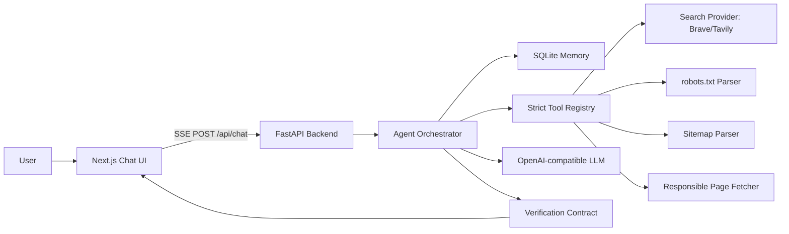
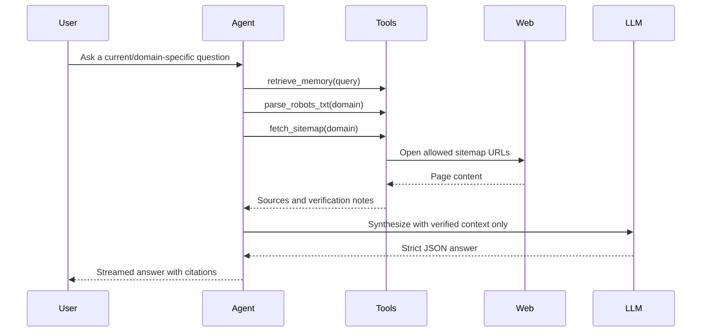
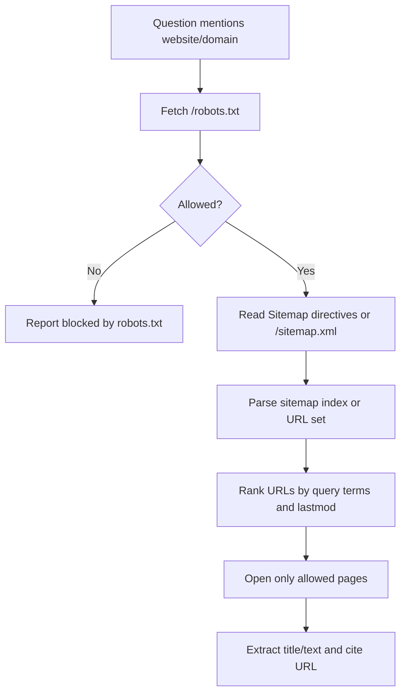

# Live AI Assistant

Production-grade full-stack AI assistant with streaming chat, tool calling, local memory, web verification, and sitemap-aware internet access.

## Live Demo

- Frontend: Coming soon
- Backend health: Coming soon

## Problem Statement

Most chatbot demos answer confidently even when the question requires current data. This project treats live information as an infrastructure problem: the assistant decides when to use memory, when to search, when to inspect a website's `robots.txt` and sitemap, and when to say that something could not be verified.

## Screenshots

Screenshots will be added after a real deployment or local capture. No mock screenshots are included.

- Chat UI: Coming soon
- Streaming verified answer: Coming soon
- Memory management: Coming soon
- Sitemap-aware crawl flow: Coming soon

## Features

- ChatGPT-style Next.js interface with streaming tokens and visible thinking/searching/verifying status.
- FastAPI agent backend with explicit orchestration instead of a one-shot prompt.
- Strict JSON-schema tool calling for `web_search`, `open_url`, `fetch_sitemap`, `parse_robots_txt`, `extract_page_content`, `save_memory`, and `retrieve_memory`.
- Sitemap-aware crawling that checks `robots.txt`, parses XML sitemap indexes and URL sets, ranks relevant URLs, and only opens allowed pages.
- Verification response contract: answer, sources, confidence, verified facts, and unavailable checks.
- SQLite memory with Postgres-ready boundary, plus list/delete endpoints.
- Docker, Docker Compose, Render backend config, Vercel frontend config, and health checks.
- Tests for sitemap parsing, robots handling, tool schema validation, and memory.

## What Makes This Different From a Normal Chatbot?

- Tool calling: the backend exposes explicit tools with strict JSON schemas, so infrastructure actions are validated before execution.
- Sitemap-aware crawling: website questions trigger sitemap discovery and URL ranking instead of blind page fetching.
- `robots.txt` safety: the crawler checks access rules and reports blocked pages instead of quietly ignoring policy.
- Verification contract: factual/current answers must return sources, confidence, what was verified, and what could not be verified.
- Memory controls: local memory is visible and deletable through API/UI controls, and sensitive data is not stored by default.

## Architecture



## Tool-Calling Flow



## Sitemap Crawling Flow



Google's public guidance says `robots.txt` controls crawler access, while sitemaps help crawlers discover URLs but do not guarantee crawling or indexing. This project follows that distinction: robots rules are treated as access constraints; sitemaps are discovery hints.

## Demo Commands

PowerShell:

```powershell
Copy .env.example .env
cd backend
python -m venv .venv
. .\.venv\Scripts\Activate.ps1
pip install -r requirements.txt
uvicorn app.main:app --reload
```

In another PowerShell window:

```powershell
cd frontend
npm install
npm run dev
```

Docker:

```powershell
docker compose up --build
```

Run tests:

```powershell
cd backend
pytest
```

## Example Prompts

- "What are the latest updates on openai.com?"
- "Check the newest product changes on vercel.com and cite the pages."
- "Remember that I prefer concise answers."
- "What do you remember about my answer style?"

## API

- `POST /api/chat` streams Server-Sent Events.
- `POST /api/search` returns configured provider search results.
- `GET /api/memories` lists local memories.
- `POST /api/memories` creates a memory.
- `DELETE /api/memories/{id}` deletes a memory.
- `GET /health` exposes service health.

## Environment

No secrets are hardcoded. Use `.env` locally and managed environment variables in production.

- `OPENAI_API_KEY` and `OPENAI_BASE_URL` configure any OpenAI-compatible model endpoint.
- `WEB_SEARCH_PROVIDER` supports `brave`, `tavily`, or `none`.
- `DATABASE_URL` defaults to local SQLite.
- `NEXT_PUBLIC_API_BASE_URL` points the frontend at the FastAPI backend.

## Deployment

Frontend: deploy `frontend/` to Vercel and set `NEXT_PUBLIC_API_BASE_URL` to the Render backend URL.

Backend: deploy `backend/` to Render using `render.yaml`, then configure `OPENAI_API_KEY` and a search provider key.

## Roadmap

- Postgres memory adapter with semantic embeddings.
- Per-domain crawl budgets and cache invalidation.
- Browser-based website rendering for JavaScript-heavy pages.
- User authentication and per-user memory partitioning.
- OpenTelemetry traces for agent decisions and tool latency.
- Evaluation suite for citation precision and refusal quality.

## Resume Bullets

- Built a full-stack live AI assistant with streaming Next.js UI, FastAPI agent orchestration, strict tool schemas, and verified citations.
- Implemented responsible sitemap-aware crawling by combining `robots.txt` policy checks, XML sitemap parsing, query-based URL ranking, and page extraction.
- Designed local SQLite memory with API controls for viewing and deleting stored context, keeping the boundary ready for production Postgres.
- Added deployment-ready infrastructure with Docker, Docker Compose, Vercel frontend config, Render backend config, health checks, and focused tests.
